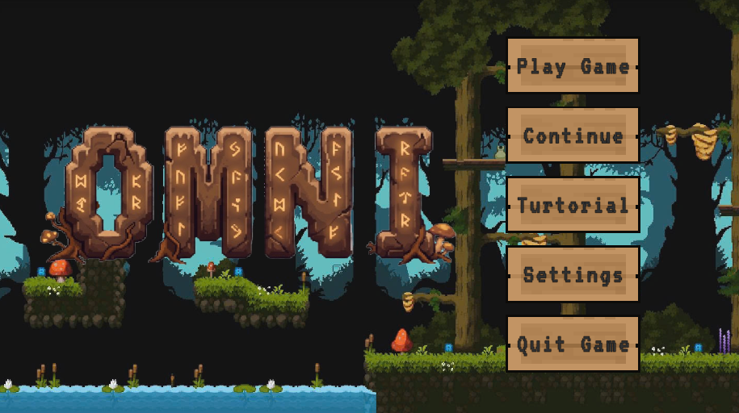
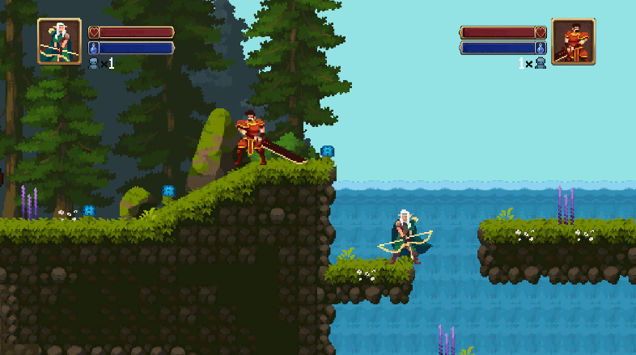
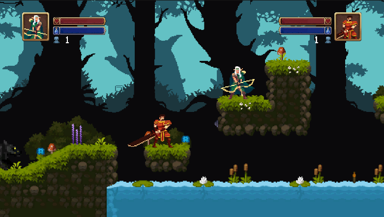
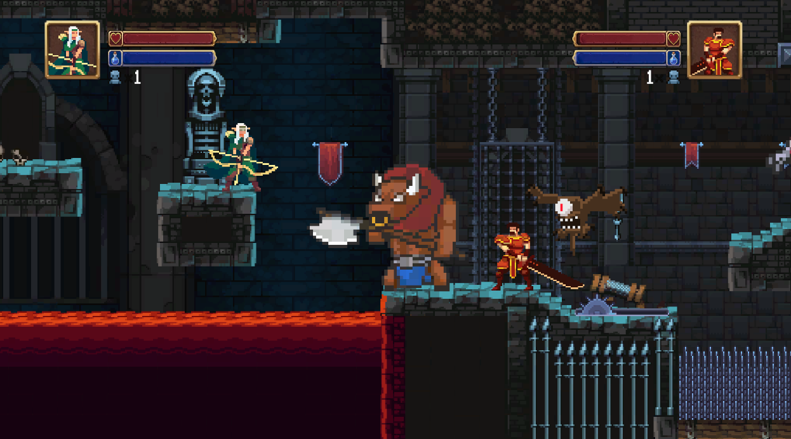
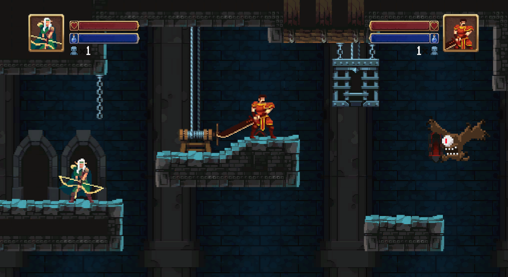
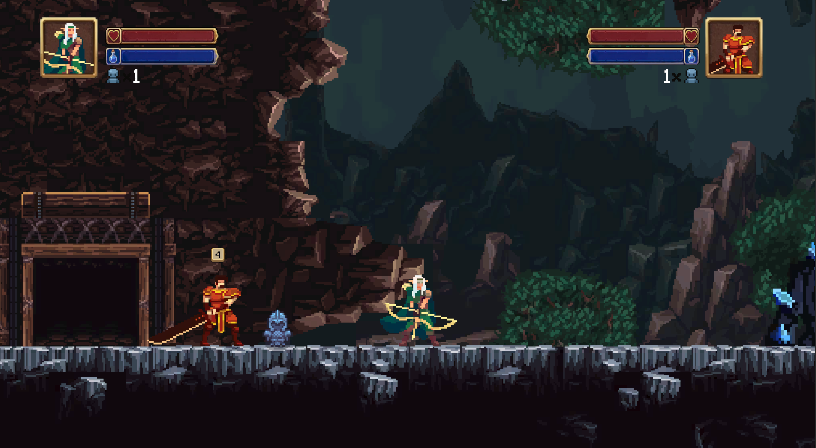
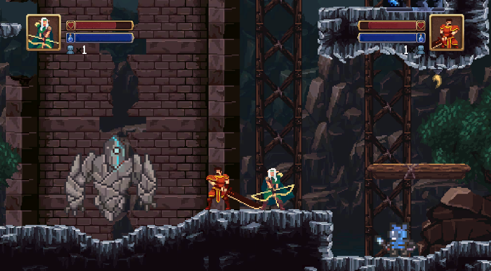

# BÁO CÁO KẾT QUẢ BÀI TẬP CUỐI KHÓA
**OMNI** *(Game 2D Action Co-op Platformer)*

---

## 1. Thông Tin Nhóm

**Tên Dự Án:** **OMNI** *(Game 2D Action Co-op Platformer)*

**Link Dự Án:** [GitHub Link](https://github.com/NgQKhanh2906/BTCK_Java_ProPTIT_Omni)

**Thành Viên Nhóm:**
- Nguyễn Quốc Khánh
- Nguyễn Tiến Thịnh
- Bùi Đức Tuân
- Phạm Hữu Chiến

**Mentor:**
- Nguyễn Mạnh Dũng
- Nguyễn Thành Trung
- Trần Khắc Long
### Mô hình làm việc

Team hoạt động theo mô hình Scrum, sử dụng Linear để quản lý công việc. Các công việc được track đầy đủ trên Linear.
- Link Linear: [Linear Link](https://linear.app/btck-omni/team/OMNI)

Mỗi tuần, team ngồi lại để review công việc đã làm, cùng nhau giải quyết vấn đề và đề xuất giải pháp cho tuần tiếp theo. Sau đó có buổi demo cho mentor để nhận phản hồi và hướng dẫn.

### Version Control Strategy

Team hoạt động theo Gitflow để quản lý code. Mỗi thành viên tạo branch từ `develop` để làm việc, các branch đặt theo format `feature/ten-chuc-nang`, sau khi hoàn thành sẽ tạo Pull Request để review và merge vào develop.

Các nhánh chính:
- `main`: Chứa code ổn định, đã qua kiểm tra và test kỹ lưỡng
- `develop`: Chứa code mới nhất, đã qua review và test
- `feature/`: Các nhánh phát triển short-live, sau khi hoàn thành sẽ merge vào `develop`


Sau mỗi tuần, team sẽ merge `develop` vào `main` để release phiên bản mới.

---

## 2. Giới Thiệu Dự Án

**Mô tả:** Dự án là một game hành động 2D thể loại platformer hỗ trợ chơi hợp tác (co-op) cho 2 người chơi. Người chơi điều khiển các nhân vật chiến đấu qua nhiều màn, tiêu diệt quái vật đa dạng, thu thập vật phẩm và đối mặt với trùm cuối. Game được phát triển bằng Unity với cấu trúc hướng đối tượng.

Điểm nổi bật:
- Hỗ trợ 2 người chơi cùng lúc (co-op local)
- Hệ thống nhân vật phong phú: Swordman (kiếm sĩ) và Archer (cung thủ) với bộ kỹ năng khác nhau
- Trên 15 loại quái vật với AI hành vi riêng biệt
- Hệ thống bẫy và item đa dạng.
- Boss lớn cuối game với nhiều pha tấn công phức tạp
- Hệ thống lưu trạng thái game (Save/Load)

---

## 3. Các Chức Năng Chính

### 3.1. Hệ Thống Nhân Vật (Player)

- Di chuyển, nhảy đa tầng (multi-jump), lăn né (roll) và dùng chiêu tốn mana
- Phòng thủ (defend) giảm sát thương 90%
- **Swordman:** Combo 3 đòn, đòn trên không, kỹ năng đặc biệt tích năng lượng (charge) tiêu toàn bộ mana, sát thương tăng theo thời gian gồng
- **Archer:** Bắn tên thường, đâm tên, tia sáng (beam), tên mưa, tấn công không trung
- Hệ thống mana tự hồi phục theo thời gian
- Hệ thống mạng sống (Lives), hồi sinh, bất tử tạm thời sau khi hồi sinh
- Cơ chế cứu đồng đội đã chết (co-op revival mechanic)

### 3.2. Hệ Thống Kẻ Địch (Enemy AI)

Hơn 15 loại quái vật khác nhau, mỗi loại có AI và hành vi riêng:

- **Bat, Bee, Flying Eye:** Bay tự do, truy đuổi theo 3D vector, tấn công cận chiến
- **Skeleton, Wolf, Slime, Ghoul, Small Golem:** Tuần tra, truy đuổi, tấn công cận chiến, phát hiện vách/mép sàn
- **Cyclops:** Tấn công cận chiến kết hợp bắn tia laser viễn chiến có line-of-sight
- **Rat Mage:** Cận chiến + phóng viên băng (IceCone) có tầm nhìn
- **Fire Elemental:** Kamikaze – tự nổ khi đến gần người chơi
- **Snail:** Có shell, khi bị đánh vào sẽ thu mình vào vỏ (90% giảm sát thương), chờ hết mối nguy mới ra ngoài
- **Mushroom:** Sau khi tấn công bị stun trong thời gian ngắn
- **Minotaur:** Combo 2 đòn thay đổi theo vòng lặp

Tất cả quái đều có: flash trắng khi bị đánh, phát hiện người chơi bằng raycast, phạm vi tuần tra, tether về vị trí ban đầu.

### 3.3. Hệ Thống Boss

- Boss tìm và nhắm mục tiêu người chơi gần nhất trong phạm vi 90 đơn vị
- 5 pha tấn công ngẫu nhiên: bắn đá định hướng, đá ngầm từ dưới đất bắn lên, laser thẳng, phòng thủ + bắn đá quạt, laser quét + hồi máu
- Object Pooling cho projectile (đá) để tối ưu hiệu năng
- Flash material khi nhận sát thương, trigger victory khi chết

### 3.4. Hệ Thống Bẫy & Môi Trường

- **SawTrap:** Bẫy cưa liên tục gây sát thương khi chạm vào
- **FireTrap:** Bẫy lửa hoạt động theo chu kỳ bật/tắt (coroutine)
- **DeathZone:** Vùng chết lập tức khiến nhân vật mất mạng

### 3.5. Hệ Thống Item & Rương Báu

- **3 loại item**: HealthPotion (hồi HP), ManaPotion (hồi Mana), ExtraLife (tăng mạng)
- **TreasureChest:** Rương báu với loot table theo trọng số (weighted random), spawn item ra xung quanh với lực văng vật lý
- **WorldItem:** Vật phẩm trên sàn có hiệu ứng nảy (DOTween), chỉ có thể nhặt sau khi rơi xuống đất

### 3.6. Hệ Thống Camera & Map

- Camera theo dõi cả 2 người chơi bằng Cinemachine Target Group
- Tự điều chỉnh zoom theo kích thước phòng
- Tự động teleport người chơi bị kẹt ở góc màn hình về vị trí đồng đội
- RoomTrigger, MapTransition, CoopDoorSystem để quản lý chuyển phòng
- **OmniLevelPortal:** Cổng chuyển scene – chờ đủ số người chơi còn sống mới load

### 3.7. Hệ Thống Save/Load & UI

- Lưu file JSON: scene hiện tại, HP/Mana/vị trí người chơi, số mạng, phòng hiện tại, rương đã mở
- **PanelManager:** Quản lý UI panels (Settings, Tutorial, Pause, Win, Lose) theo pattern lazy-instantiate
- **HealthBar, ManaBar:** Cập nhật realtime theo event-driven (subscribe OnHPChanged, OnManaChanged)
- **GlobalFader:** Hiệu ứng fade-in/out khi chuyển scene dùng unscaled time

---

## 4. Công Nghệ

### 4.1. Công Nghệ Sử Dụng

- Unity (2D) – Engine phát triển game chính
- C# – Ngôn ngữ lập trình chính
- Cinemachine – Quản lý camera nâng cao (Target Group, Confiner)
- DOTween – Thư viện tween animation cho UI và VFX
- UnityEngine.Pool (ObjectPool) – Quản lý bộ nhớ cho projectile
- JsonUtility – Serialize/Deserialize dữ liệu save game
- Git + Gitflow + Git Fork – Quản lý version control
- Linear – Quản lý task và sprint theo mô hình Scrum

### 4.2. Cấu Trúc Dự Án

```
Assets                                                                      
├─ Animations   //Lưu trữ các hoạt ảnh chuyển động                                                                                                      
├─ Audio        //Lưu trữ file âm thanh, sound effect                                                                                                             
├─ Font         //Phông chữ trong toàn bộ dự án                                                                                                                
├─ GameData     //Lưu giữ liệu của items                                                                                                                     
├─ Materials    //Player Physic                                                                                              
├─ Plugins      //DOTween                                                                                                                    
├─ Prefabs      //Lưu trữ các file prefab                                                                                                
├─ Resources (DOTween)                                                                                                       
├─ Scenes       //Lưu tất cả các scene trong game                                                                                                     
├─ Scripts      //Lưu các file code                                                         
│  ├─ Audio                                                                                                              
│  ├─ Boss                                                                                                             
│  ├─ Characters                                                            
│  │  ├─ Archer                                                                                                              
│  │  ├─ Share                                                                                                  
│  │  └─ Swordman                                                                                                               
│  ├─ Controller                                                            
│  │  ├─ GameManager.cs                                                                                                   
│  │  ├─ LivesManager.cs                                                                                               
│  │  ├─ MainMenuManager.cs                                                                                            
│  │  ├─ PanelManager.cs                                                                                                  
│  │  └─ PlayerDataManager.cs                                                                                         
│  ├─ Core                                                                  
│  │  ├─ Interfaces                                                                                                       
│  │  └─ Entity.cs                                                                                                           
│  ├─ Enemy                                                                                                             
│  ├─ Interactables                                                                                                        
│  ├─ MapTransition                                                                                                 
│  ├─ Saving                                                                                                              
│  ├─ Trap                                                                                                                    
│  ├─ UI                                                                                                       
│  └─ Utils                                                                                                                                                                       
├─ Sprites      // Lưu tổng hợp asset                                                                                                                                                                                        
├─ TextMesh Pro                                                                                                                                                                                                                                                                                                             
├─ Tile         //Lưu các tile dùng cho tile palette                                                             
│  ├─ Map1                                                                                                                                                            
│  └─ Map2                                                             
└─ VFX          //Lưu các VFX hỗ trợ trong game                                                                                                                              
                
```

Diễn giải:

- **Audio**: Quản lý âm thanh tổng thể và các hiệu ứng âm thanh (SFX) trong game.

- **Boss**: Logic AI của Boss và đạn/kỹ năng đặc thù (VD: đá của Boss).

- **Characters**: Gộp chung logic nhân vật người chơi (Archer, Swordman) cùng các script dùng chung cho Player (Share). Đạn của cung thủ cũng được đặt gọn trong này.

- **Controller**: Quản lý trạng thái và luồng dữ liệu toàn cục như Game, Lives, Menu, Panels và Dữ liệu người chơi.

- **Core**: Chứa Entity base class và hệ thống Interfaces dùng chung cho toàn bộ dự án.

- **Enemy**: Quản lý AI quái vật được chia gọn gàng vào từng thư mục riêng rẽ (kèm theo đạn riêng của chúng), cùng các module dùng chung như phát hiện người chơi, phát hiện mép tường.

- **Interactables**: Quản lý các vật thể có thể tương tác trên map như rương, trạm hồi phục, dữ liệu item.

- **MapTransition**: Xử lý các logic liên quan đến map như camera, chuyển cảnh (transition/fader), hệ thống cửa, cổng dịch chuyển và khởi tạo scene.

- **Saving**: Module độc lập chuyên xử lý việc lưu/tải game.

- **Trap**: Chứa logic của bẫy và các khu vực gây sát thương/chết người.

- **UI**: Xử lý hệ thống giao diện, thanh máu/mana, cutscene, cài đặt và hướng dẫn.

- **Utils**: Chứa các lớp tiện ích dùng làm công cụ hỗ trợ như Singleton pattern, check chạm đất, hoặc chống lật sprite.

---

## 5. Ảnh và Video Demo

**Ảnh Demo:**







**Video Demo:**

https://drive.google.com/file/d/17mHLaPHX8_LG0-iFgy8yrIU0bB-D4bqV/view?usp=drive_link

**Game demo itch.io:**
https://cheindepzais1th.itch.io/omni?fbclid=IwY2xjawRplX5leHRuA2FlbQIxMABicmlkETFOUVk1d2d2YWRQcjVsbGRVc3J0YwZhcHBfaWQQMjIyMDM5MTc4ODIwMDg5MgABHpCTXdvh7J_nquJl-0BT8E_DW1z3iwmmj_bROTtfyPk7ISYSynAYqwagCoZ8_aem_QHeyj4mvVuS5rCxvO2W2cA

---

## 6. Các Vấn Đề Gặp Phải

### Vấn Đề 1: Hiệu năng kém khi có nhiều projectile trên màn hình

**Mô tả vấn đề:** Khi Boss bắn nhiều đá (attack 2 – mưa đá 30 viên), Archer bắn nhiều tên, và nhiều quái vật bắn projectile cùng lúc, game bị giật lag do liên tục tạo và hủy GameObject, gây áp lực lớn lên Garbage Collector của Unity.

### Hành Động Để Giải Quyết

**Giải pháp:** Áp dụng Design Pattern **Object Pool** (`UnityEngine.Pool.ObjectPool`) cho tất cả các projectile: `RockProjectile` (boss), `Arrow` (Archer), và `CyclopsBeam`. Thay vì `Instantiate/Destroy` mỗi lần, các object được lấy ra từ pool khi cần và trả về pool khi hết dùng.

### Kết Quả

Loại bỏ hoàn toàn GC spike liên quan đến projectile. FPS ổn định hơn trong các màn có nhiều projectile. Boss có thể bắn đến **200 viên đá** trong pool mà không gây hiệu năng bất thường.

---

### Vấn Đề 2: Quản lý quá nhiều loại quái vật khác nhau

**Mô tả vấn đề:** Với hơn 15 loại quái vật, mỗi loại có AI khác nhau nhưng cũng có nhiều điểm chung (tuần tra, truy đuổi, nhận sát thương, flash, âm thanh...). Nếu viết độc lập thì code trùng lặp rất nhiều, khó maintain và mở rộng.

### Hành Động Để Giải Quyết

**Giải pháp:** Xây dựng hệ thống kế thừa rõ ràng theo **Template Method Pattern**: `Entity` (base) → `EnemyBase` (logic chung: patrol, idle, flash, SFX, ledge/wall detect) → các class quái cụ thể chỉ override phần AI riêng biệt (`ChasePlayer`, `Update`). Ngoài ra tách `PlayerDetector` thành component riêng biệt theo **Single Responsibility Principle**.

### Kết Quả

Thêm quái mới chỉ cần tạo class kế thừa `EnemyBase` và override các hàm cần thay đổi. Logic chung (flash khi đánh, SFX, patrol, tether về home) không cần viết lại. Toàn bộ 15+ quái chỉ cần **~100 dòng code** mỗi class thay vì 500+ dòng.

---

### Vấn Đề 3: Đồng bộ trạng thái 2 người chơi khi chuyển scene

**Mô tả vấn đề:** Khi chuyển scene (sang map mới), các `PlayerBase` object bị destroy và tạo lại. HP, Mana, trạng thái chết, vị trí an toàn cuối cùng của người chơi bị mất. Cần một cơ chế để bảo toàn và khôi phục dữ liệu người chơi qua scene.

### Hành Động Để Giải Quyết

**Giải pháp:** Thiết kế `PlayerDataManager` (Singleton, DontDestroyOnLoad) để snapshot trạng thái người chơi trước khi chuyển scene và khôi phục sau khi scene mới load. Kết hợp với `PlayerHUD.ConnectToPlayer()` và `LivesManager.CheckLoadDeadState()` để xử lý edge case người chơi đang chết khi chuyển scene.

### Kết Quả

Trạng thái người chơi (HP, Mana, số mạng, tình trạng chết) được **bảo toàn hoàn toàn** qua scene transitions. Người chơi đang chết sẽ tiếp tục ở trạng thái chết hoặc hồi sinh đúng vị trí ở scene mới.

---

### Vấn Đề 4: Camera co-op bị vỡ khi 2 người chơi quá xa nhau

**Mô tả vấn đề:** Khi 2 người chơi ở hai phòng khác nhau hoặc cách quá xa, camera zoom out đến mức không nhìn thấy gì, hoặc một người bị kẹt ở ngoài rìa màn hình không thể di chuyển tiếp.

### Hành Động Để Giải Quyết

**Giải pháp:** Implement cơ chế **Auto-Teleport** trong `CamController`: nếu một người chơi bị kẹt ở biên màn hình liên tục hơn `timeToTeleport` giây, tự động teleport về vị trí đồng đội (người chơi có Y cao nhất). Camera zoom được giới hạn theo Cinemachine Confiner của từng phòng.

### Kết Quả

Không còn tình trạng một người chơi mắc kẹt ngoài màn hình. Co-op experience mượt mà hơn khi hai người chơi di chuyển theo tốc độ khác nhau.

---

### Vấn Đề 5: Quản lý gitflow chưa tốt dẫn đến conflict nhiều

**Mô tả vấn đề:** Thời gian đầu khi chưa thực sự quen với làm việc trong git nên commit và push code đè lên nhau dẫn đến conflict, mất file và rối dự án.

### Hành Động Để Giải Quyết

**Giải pháp:** Đặt quy tắc commit, push, pull request và merge cho tất cả mọi người đồng thời thống nhất luồng làm việc: bắt đầu làm thì pull code develop về rồi tạo nhánh để sửa; chỉ up những thứ liên quan đến nội dung mình sửa. Tạo pull request và merge khi có 2 người đồng thuận trở lên.

### Kết Quả

Từ sau khi thống nhất, tỷ lệ conflict và hỏng code giảm mạnh. Các nội dung commit được đảm bảo đúng chuẩn nhiệm vụ và bám sát theo phân công trên Linear.

---


## 7. Kết Luận

**Kết quả đạt được:** Nhóm đã hoàn thành một game 2D co-op platformer hoàn chỉnh với đầy đủ gameplay loop: di chuyển, chiến đấu, quái vật AI đa dạng, boss, bẫy, item, rương báu, hệ thống mạng sống, save/load, và camera co-op thông minh. Code được tổ chức tốt theo các Design Pattern (Singleton, Template Method, Object Pool, Observer) giúp dễ mở rộng và bảo trì.

**Hướng phát triển tiếp theo:**
- Thêm nhiều màn chơi với độ khó tăng dần
- Thêm nhân vật mới với bộ kỹ năng hoàn toàn khác
- Hỗ trợ online co-op (Netcode for GameObjects / Mirror)
- Hệ thống skill tree và nâng cấp nhân vật
- Cải thiện AI quái vật với hành vi phức tạp hơn (Behavior Tree / GOAP)
